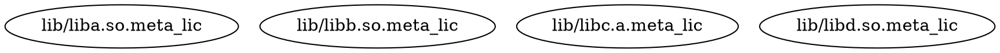
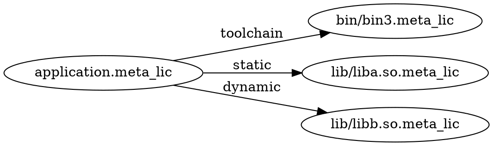
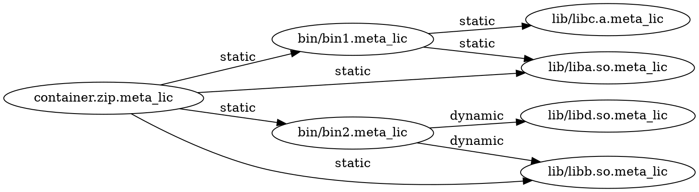
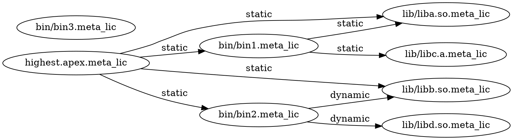
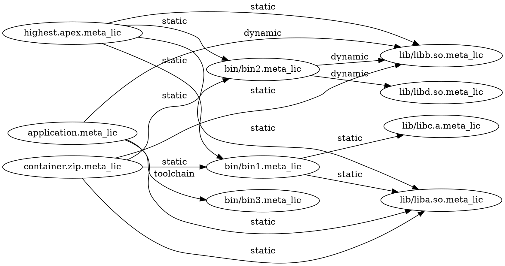
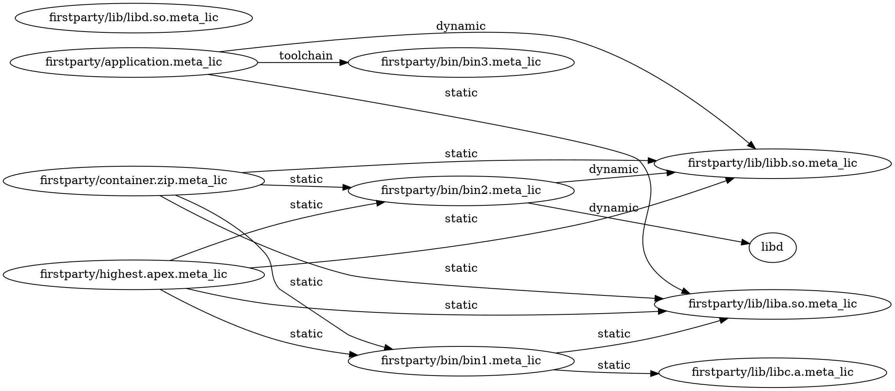
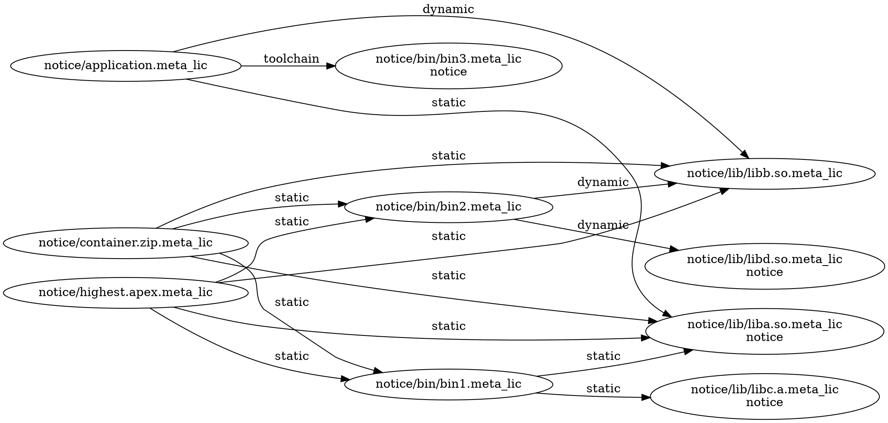
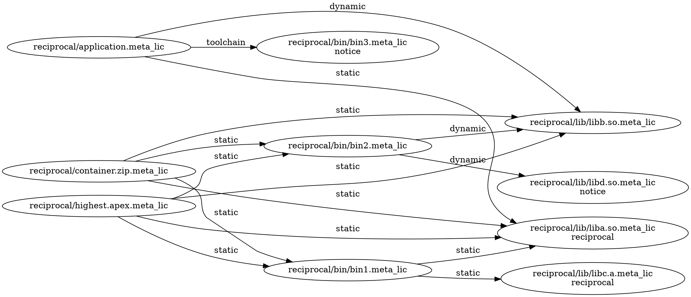
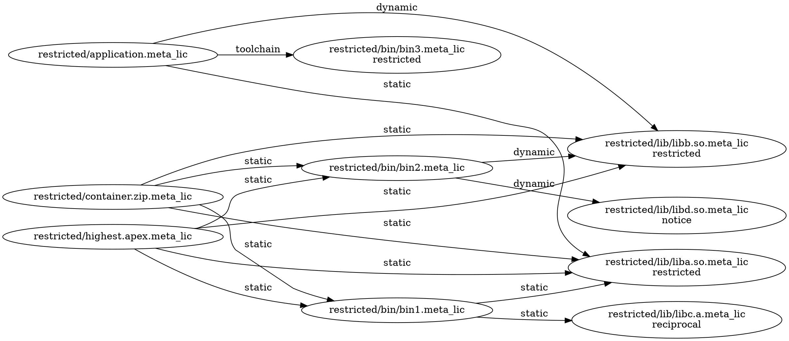
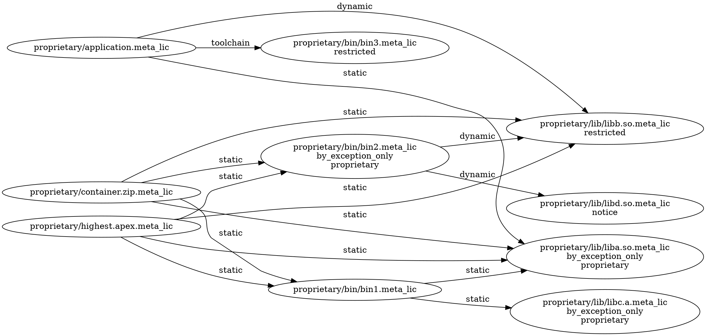

## Test data

Each non-regression directory under testdata/ defines a similar build graph.
All have the same structure, but different versions of the graph have different
license metadata.

The regression* directories can have whatever structure is required for the
specific test case.

### Testdata build graph structure:

The structure is meant to simulate some common scenarios:

*   a `lib/` directory with some libraries
*   a `bin/` directory with some executables
*   one of the binaries, `bin3`, is a toolchain executable like a compiler
*   an `application` built with the `bin3` compiler and linking a couple libraries
*   a pure aggregation `continer.zip` that merely bundles files together, and
*   an apex file (more like an apk file) with some binaries and libraries.

The testdata starts with a `firstparty/` version containng only first-party
licenses, and each subsequent directory introduces more restrictive conditions:

*   `notice/` starts with `firstparty/` adds third-party notice conditions
*   `reciprocal/` starts with `notice/` and adds some reciprocal conditions
*   `restricted/` starts with `reciprocal/` and adds some restricted conditions
*   `proprietary/` starts with `restricted/` and add some privacy conditions

#### a `lib/` directory with some libraries

#### a `bin/` directory with some executables

strict digraph {
	rankdir=LR;
	bin1 [label="bin/bin1.meta_lic"];
	bin2 [label="bin/bin2.meta_lic"];
	bin3 [label="bin/bin3.meta_lic\ntoolchain"];
	liba [label="lib/liba.so.meta_lic"];
	libb [label="lib/libb.so.meta_lic"];
	libc [label="lib/libc.a.meta_lic"];
	libd [label="lib/libd.so.meta_lic"];
	bin1 -> liba [label="static"];
	bin1 -> libc [label="static"];
	bin2 -> libb [label="dynamic"];
	bin2 -> libd [label="dynamic"];
	{rank=same; bin1 bin2 bin3}
}

#### an `application` built with the `bin3` compiler and linking a couple libraries

#### a pure aggregation `container.zip` that merely bundles files together

#### an apex file (more like an apk file) with some binaries and libraries

#### the whole build graph

### firstparty/ testdata starts with all first-party licensing

### notice/ testdata introduces third-party notice conditions

### reciprocal/ testdata introduces third-party reciprocal sharing conditions

### restricted/ testdata introduces restricted source sharing conditions

### proprietary/ testdata introduces privacy conditions

