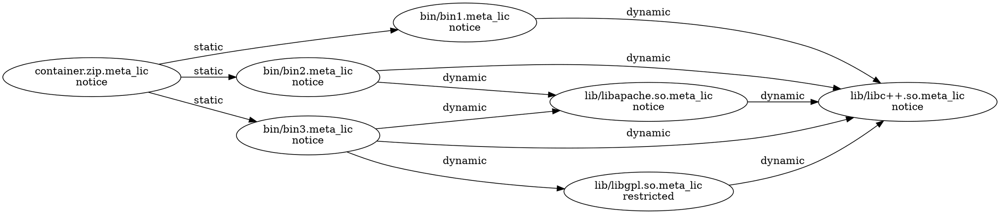

## Shipped versus non-shipped libraries with restricted license

### Testdata build graph structure:

A restricted licensed library sandwiched between a notice library and a notice
binary. The source-code for the libraries only needs to be shared if shipped
alongside the container with the binaries.

